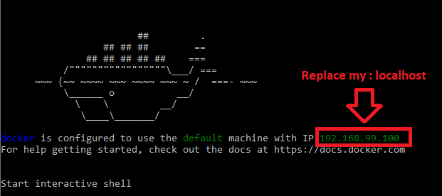

# Prisma PostgreSQL test on Windows 10
Project Test of prisma postgreSQL with Docker on windows

## Install Prisma : 
```
npm install -g prisma
```

Docker on windows have an IP address here:


## Go to hello-world:
```
cd hello-world
```

## Pull all docker image call in my file docker-compose.yml:
```
docker-compose up -d
```

## Configure prisma : prisma init --endpoint http://localhost:4466
```
prisma init --endpoint http://192.168.99.100:4466 
```
prisma.yml and datamodel.prisma created

## Deploy Prisma : 
```
prisma deploy
```

## View and edit : http://localhost:4466/_admin
```
http://192.168.99.100:4466/_admin
```